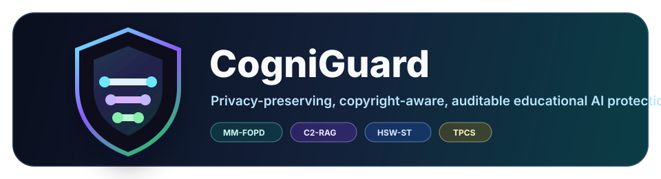

# CogniGuard

<p align="center">
  
</p>

<p align="center">
  
  
  
  
  
  
</p>

<p align="center">
  <b>面向个性化教育大模型的学生隐私保护、教师资源版权保护与生成内容审计追踪闭环系统</b>
</p>

CogniGuard 是一个面向硕士毕业论文实验与演示的教育 AI 保护平台。项目关注个性化教学中三个同时存在的风险：学生画像泄漏、教师资源版权重构、生成内容难以追责。系统由三类保护机制和一个横向治理控制器组成，并通过多智能体教学流程串联成闭环。

## 核心创新

| 模块 | 全称 | 解决的问题 | 主要输出 |
|---|---|---|---|
| `MM-FOPD` | Multimodal Minimum Field-Oriented Profile Disclosure | 学生画像过度披露、raw multimodal profile 进入第三方模型 | 最小上下文卡片、画像选择记录、披露指标 |
| `C2-RAG` | Copyright-Constrained Retrieval-Augmented Generation | 教师资源被逐轮重构、原文片段泄漏 | 受控返回模式、暴露预算、资源级溯源 commitment |
| `HSW-ST` | Hybrid Semantic Watermarking and Source Tracing | 生成内容被篡改、复制、争议归因 | 水印记录、审计链、篡改检测与追踪证据 |
| `TPCS` | Trustworthy Policy Control System | 三机制之间缺少统一策略约束 | 横向策略控制、降级、拒答、合规审计 |

关键设计不是简单堆叠三个模块，而是让它们互相提供受控证据：

- `FOPD -> C2-RAG`：只把最小学习上下文交给资源检索，不暴露 raw profile。
- `C2-RAG -> HSW-ST`：把 `resource_provenance_commitment` 交给生成审计，不把水印职责放进版权模块。
- `HSW-ST -> TPCS`：把篡改、相似度、重构风险反馈给横向治理控制器。
- `TPCS -> all`：统一决定是否最小化、降级、拒答、删除或 hash-only 保留。

## 系统流程

```mermaid
flowchart LR
    A["Raw student multimodal data"] --> B["MM-FOPD<br/>minimum profile disclosure"]
    B --> C["Minimum context card"]
    C --> D["TPCS<br/>privacy/compliance pre-check"]
    D --> E["Profile diagnosis agent"]
    E --> F["C2-RAG<br/>copyright-aware retrieval"]
    F --> G["Controlled resource<br/>summary / outline / variant / refuse"]
    G --> H["Pedagogical teaching agent"]
    H --> I["HSW-ST<br/>watermark + audit chain"]
    I --> J["Protected teaching answer"]
    J --> K["Learning assessment"]
    K --> L["TPCS profile update gate"]
    L --> B
```



## 联合协同实验效果

当前已经增加端到端联合实验 `experiments/evaluation/eval_joint_synergy.py`，比较单模块、双模块、三模块和 `Full+TPCS`。核心指标是 `JointRisk`，越低越好。

| 方法 | JointRisk ↓ | Utility ↑ | 说明 |
|---|---:|---:|---|
| `None` | `1.000` | `0.658` | 无保护 |
| `Best single: FOPD-only` | `0.680` | `0.804` | 最强单模块 |
| `Best pair: FOPD+HSWST` | `0.415` | `0.820` | 最强双模块 |
| `Full CogniGuard w/o TPCS` | `0.272` | `0.836` | 三机制联合 |
| `Full CogniGuard+TPCS` | `0.245` | `0.839` | 三机制 + 横向治理 |

结论：`Full CogniGuard+TPCS` 的联合风险低于任意单模块和任意双模块组合。

```text
SynergyGain vs best pair = 0.1708
TPCS gain                 = 0.0275
Full beats best pair      = True
```

### 图示

如果图片未显示，请先运行下面的“联合实验与绘图”命令。

<p align="center">
  
</p>

<p align="center">
  
</p>

## 快速开始

### 1. 安装依赖

```bash
pip install -r requirements.txt
```

前端依赖：

```bash
cd frontend
npm install
```

### 2. 运行后端演示服务

```bash
python server.py 8000
```

默认会启动轻量 HTTP 服务，并提供 `/api/*` 数据接口。没有真实 LLM key 时，系统会使用 deterministic fallback，方便本地演示和测试。

### 3. 运行前端面板

```bash
cd frontend
npm run dev
```

Vite 开发服务会把 `/api` 请求代理到 `http://localhost:8000`。

### 4. 运行完整闭环 demo

```bash
python -m backend.app.demo.run_demo --case-index 0
```

输出会包含：

- `workflow_steps`
- `agent_outputs`
- `protection_logs`
- `compliance_state`
- `compliance_policy`
- `audit_trace`
- `final_protected_teaching_answer`

## 实验入口

### 联合协同实验

```bash
python -m experiments.evaluation.eval_joint_synergy --config protection/student_profile/configs/default.yaml
```

生成：

- `experiments/results/joint_synergy/joint_synergy_rows.csv`
- `experiments/results/joint_synergy/joint_synergy_summary.csv`
- `experiments/results/joint_synergy/joint_risk_reduction.csv`
- `experiments/results/joint_synergy/joint_synergy_gain.csv`
- `experiments/results/joint_synergy/joint_synergy_results.json`

生成论文图：

```bash
python -m experiments.common.plot_joint_synergy
```

### 隐私与版权 baseline 对比

```bash
python -m experiments.baselines.run_baseline_comparisons --config protection/student_profile/configs/default.yaml
```

覆盖的隐私 baseline：

- `PII-Redaction`
- `PresidioStyle-PII-Masking`
- `RBAC-only`
- `ABAC-PurposeOnly`
- `DP-NoisyTopK`
- `LocalOnly-NoThirdParty`

覆盖的版权 baseline：

- `ProtectedMaterialDetector`
- `MemFree-Ngram`
- `SHIELD-Agent`
- `BloomScrub-Rewrite`
- `R-CAD-Approx`

### 组件消融

```bash
python -m experiments.ablation.run_protection_ablations --config protection/student_profile/configs/default.yaml
```

FOPD 消融包括：

- `BasicFOPD`
- `EnhancedFOPD-Full`
- `EnhancedFOPD-w/o-Orthogonal`
- `EnhancedFOPD-w/o-TaskAttention`
- `EnhancedFOPD-w/o-Bottleneck`
- `EnhancedFOPD+TPCS`

C2-RAG 消融包括：

- `C2RAG-full`
- `C2RAG-w/o-Budget`
- `C2RAG-w/o-Variant`
- `PlainRAG`
- `RAG-Truncation`
- `RAG-SummaryOnly`
- `GuardrailOnly`

### HSW-ST 文本水印实验

```bash
cd protection/audit_trace
python src/main.py --config configs/config.yaml --mode demo
```

批量消融：

```bash
python -m experiments.ablation.run_all_ablations --mode experiment
```

## 项目结构

```text
CogniGuard/
├── backend/                         # 后端 API、多智能体编排、demo 服务
│   └── app/
│       ├── agents/                  # 教学智能体与受保护通信
│       ├── api/                     # 前端数据适配接口
│       ├── compliance/              # FERPA/COPPA 风格合规治理闭环
│       ├── demo/                    # 完整闭环 demo
│       └── protection/              # 图像水印、TPCS 等后端 wrapper
├── frontend/                        # React + Vite 可视化面板
├── protection/
│   ├── student_profile/             # MM-FOPD 学生画像隐私保护
│   ├── teacher_resource/            # C2-RAG 教师资源版权保护
│   ├── audit_trace/                 # HSW-ST 文本水印与审计追踪
│   ├── tpcs_guardrails/             # 横向治理控制配置
│   └── common/                      # 跨层 schema、文本工具、trace binding
├── experiments/
│   ├── attacks/                     # 隐私、版权、水印、污染等攻击脚本
│   ├── baselines/                   # 隐私与版权 baseline
│   ├── evaluation/                  # 分层与联合评估脚本
│   ├── ablation/                    # 组件消融批量运行
│   ├── common/                      # 实验绘图与公共工具
│   └── results/                     # 实验输出，默认不纳入版本管理
├── docs/                            # 论文建议、架构说明、API 文档
└── server.py                        # 本地演示 HTTP 服务
```

## 机制边界

### C2-RAG 的资源侧溯源

C2-RAG 负责资源级 provenance：

- `resource_id`
- `chunk_id`
- `license_policy`
- `return_mode`
- `exposure_before`
- `exposure_after`
- `policy_reason`
- `retrieval_trace`
- `quote_span_hash`
- `controlled_output_hash`
- `resource_provenance_commitment`

### HSW-ST 的生成侧审计

HSW-ST 负责生成内容级别的水印和审计：

- `watermark_id`
- `audit_hash`
- `seed_commitment`
- `watermarked_answer_sha256`
- `tamper_suspicion`
- `TraceBindRate`

HSW-ST 绑定 C2-RAG 的资源级 commitment，但不重新定义资源版权溯源；C2-RAG 也不承担生成水印检测职责。

## 合规治理闭环

项目包含一个合规治理模块，作为 TPCS 的横向策略来源，而不是第四个主创新机制。当前覆盖：

- `compliance_state`
- `compliance_policy`
- `compliance_audit_log`
- `data_category`
- FERPA/COPPA 风格策略判断
- 删除请求后的 hash-only 处理
- 审计 hash chain

核心规则包括：

- COPPA 场景未获得父母同意时，不收集或发送儿童个人信息。
- FERPA 场景下，教育记录必须处于授权和合法教育目的范围内。
- 第三方 LLM 默认只能接收 sanitized context card，不能接收 raw profile。
- audit chain 仅保存 hash commitment，不保存原始学生数据。

## 测试

```bash
python -m pytest backend/app/tests protection/student_profile/tests protection/teacher_resource/tests experiments/attacks/tests -q
```

当前验证结果：

```text
71 passed
```

前端构建：

```bash
cd frontend
npm run build
```

## 论文写作建议

推荐将实验组织为四个研究问题：

1. `RQ1`：CogniGuard 是否比常规隐私/版权 baseline 更能降低风险？
2. `RQ2`：FOPD、C2-RAG、HSW-ST 的组件分别贡献多少？
3. `RQ3`：三者联合是否优于任意单模块和任意双模块？
4. `RQ4`：TPCS 是否进一步提升跨模块治理效果，同时保持教学可用性？

当前最能支撑创新性的结果是联合协同实验：

```text
JointRisk(None)              = 1.000
JointRisk(best single)       = 0.680
JointRisk(best pair)         = 0.415
JointRisk(Full+TPCS)         = 0.245
SynergyGain vs best pair     = 0.171
```

这可以直接作为“大论文系统创新”主线：CogniGuard 不是三个独立保护器的拼接，而是一个由 TPCS 协调的教育 AI 全生命周期保护闭环。

## License

This project is released under the repository license. It is intended for research prototyping, thesis experiments, and educational AI safety demonstrations.
